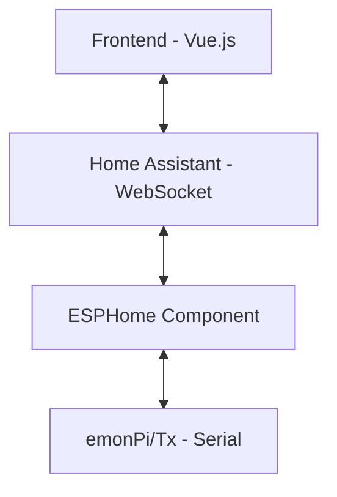

# Architecture Documentation

This document describes the technical architecture of the emonPi/Tx Configuration integration for Home Assistant.

## Overview

The integration consists of two main parts:
1. **Backend (Python)**: Home Assistant integration that registers the panel, handles WebSocket communication, and manages configuration storage
2. **Frontend (Vue.js)**: Single-page application displayed in an iframe that provides the user interface

## Communication Flow



Commands flow down, responses flow back up.

1. User interacts with the Vue.js frontend
2. Frontend sends commands via Home Assistant WebSocket API
3. Home Assistant calls ESPHome services
4. ESPHome component sends commands to emonPi/Tx via UART
5. Responses flow back through the same chain via events

## Project Structure

```
ha-emon-config/
├── custom_components/
│   └── emontx_config/
│       ├── __init__.py          # Integration setup, WebSocket handlers
│       ├── config_flow.py       # Configuration flow for setup wizard
│       ├── const.py             # Constants (domain, event names)
│       ├── manifest.json        # Integration metadata
│       ├── strings.json         # Config flow strings (reference)
│       ├── translations/        # Config flow translations
│       │   ├── en.json
│       │   ├── fr.json
│       │   └── de.json
│       └── frontend/            # Vue.js frontend application
│           ├── panel.html       # Main entry point
│           ├── panel.css        # Global styles
│           ├── components/      # Vue components
│           ├── mixins/          # Vue mixins (shared logic)
│           └── i18n/            # UI translations
├── hacs.json                    # HACS configuration
└── README.md                    # User documentation
```

## Backend Architecture

### `__init__.py`

The main integration file handles:

- **Panel Registration**: Registers an iframe panel in Home Assistant's sidebar
- **Static File Serving**: Serves frontend files from `/emontx_config_static/`
- **WebSocket Commands**: Two custom WebSocket endpoints for channel names:
  - `emontx_config/get_channel_names`: Retrieve stored channel names
  - `emontx_config/save_channel_names`: Persist channel names to config entry
- **Event Listening**: Listens for `esphome.emontx_raw` events from ESPHome
- **Service Registration**: Registers `emontx_config.send_command` service

### `config_flow.py`

Implements the Home Assistant config flow for initial setup:
- Discovers available ESPHome devices with `_send_command` services
- Allows user to select which device to configure
- Creates the config entry

### `const.py`

Defines constants:
- `DOMAIN`: `"emontx_config"`
- `EVENT_EMONTX_RAW`: `"esphome.emontx_raw"`
- `CONF_ESPHOME_DEVICE`: Configuration key for device name

## Frontend Architecture

The frontend is a Vue.js 2.x application loaded in an iframe. It communicates with Home Assistant via the WebSocket API.

### Entry Point: `panel.html`

- Loads Vue.js from CDN
- Loads all components, mixins, and styles
- Initializes the main Vue instance with:
  - Data properties for device state, UI state, translations
  - Computed properties for derived state
  - Lifecycle hooks for initialization

### Components (`components/`)

| File | Description |
|------|-------------|
| `config-tab.js` | Main configuration interface with sub-tabs for energy sensors, other sensors, and settings |
| `terminal-tab.js` | Serial terminal for direct command input/output |
| `live-data-tab.js` | Real-time display of sensor values |
| `accumulators-tab.js` | Energy and pulse accumulator management |
| `modals.js` | Modal dialogs (zero confirmation, RF power warning, bulk CT settings, YAML generator) |

### Mixins (`mixins/`)

Mixins extract reusable logic from the main Vue instance:

| File | Description |
|------|-------------|
| `connection.js` | WebSocket connection to Home Assistant, event handling |
| `data-parser.js` | Parsing device responses (config data, live data), firmware update checking |
| `config-commands.js` | Methods for sending configuration commands to device |
| `yaml-generator.js` | ESPHome YAML configuration generation |
| `channel-names.js` | Channel name management (load, save, export, import) |

### Internationalization (`i18n/`)

UI translations in JSON format:
- `en.json` - English (default)
- `fr.json` - French
- `de.json` - German
- `it.json` - Italian

Language is auto-detected from Home Assistant settings.

## Data Flow Details

### Sending Commands to Device

```javascript
// Frontend (Vue.js)
this.hass.callService('esphome', 'devicename_send_command', { command: 'l' });

// ESPHome component adds CR+LF and sends via UART
// emonPi/Tx processes command and responds
```

### Receiving Data from Device

```javascript
// ESPHome fires event with serial data
hass.bus.async_fire('esphome.emontx_raw', { data: '...' });

// Frontend listens via WebSocket subscription
this.hass.subscribeEvents(callback, 'esphome.emontx_raw');

// data-parser.js mixin parses the response
this.parseDeviceData(eventData);
```

### Channel Names Storage

Channel names are stored in the config entry's `options`:

```python
# Backend stores in config entry
entry.options = {
    "channel_names": {
        "device_name": {
            "ct": {"1": "Kitchen", "2": "Living Room"},
            "voltage": {"1": "Main Supply"},
            "opa": {},
            "temp": {"28-abc123": "Outside"}
        }
    }
}
```

## Styling

`panel.css` provides:
- Responsive layout (mobile-friendly)
- Card-based UI components
- Terminal styling (dark theme)
- Tab navigation
- Form elements and buttons
- Modal overlays
- Status indicators
- Floating action bar for pending changes

## Adding New Features

### Adding a New Tab

1. Create component in `components/new-tab.js`
2. Register component in `panel.html`
3. Add tab button and content area
4. Add translations in all `i18n/*.json` files

### Adding a New Configuration Option

1. Add parsing logic in `mixins/data-parser.js`
2. Add UI controls in appropriate component
3. Add command sending in `mixins/config-commands.js`
4. Update translations

### Adding a New Language

1. Copy `i18n/en.json` to `i18n/xx.json`
2. Translate all strings
3. Add language code to detection in `panel.html` (`detectLanguage` method)
4. Copy `translations/en.json` to `translations/xx.json` for config flow

## Dependencies

- **Home Assistant**: 2023.1.0+
- **ESPHome**: With emonTx component from [PR #9027](https://github.com/esphome/esphome/pull/9027)
- **Vue.js**: 2.7.14 (loaded from CDN)

## Build & Development

No build step required - the frontend uses vanilla Vue.js loaded from CDN. To develop:

1. Clone the repository
2. Copy `custom_components/emontx_config` to your HA `config/custom_components/`
3. Restart Home Assistant
4. Edit files and hard-refresh browser (Ctrl+Shift+R) to see changes

Frontend files are served with `cache_headers=False` for easier development.

## ESPHome Component Details

The ESPHome emonTx component acts as a bridge between Home Assistant and the emonPi/Tx device.

### Configuration

```yaml
emontx:
  config_panel: true
```

When `config_panel: true` is set, the component:

1. **Registers a service**: `esphome.<device_name>_send_command`
   - Accepts a `command` parameter (string)
   - Automatically appends CR+LF to commands (required by emonTx firmware)
   - Sends the command via UART to the emonPi/Tx

2. **Fires events**: `esphome.emontx_raw`
   - Triggered for every line received from the emonPi/Tx serial port
   - Event data contains the raw serial output

### Event Data Format

```javascript
// Example event data
{
  "device_id": "abc123",
  "data": "V1=240.5,P1=1500,P2=200,E1=12345,E2=6789,T1=21.5,MSG=42"
}
```

The frontend parses different response types:
- **Live data**: Comma-separated values (V, P, E, T, pulse, MSG)
- **Config response**: Multi-line output from `l` command
- **Version info**: Response from `v` command
- **Acknowledgments**: `k+` (success) or `k?` (failure) after config commands

## State Management

The Vue.js frontend manages device state through several key data structures.

### Device State

```javascript
device: {
  // Device info
  firmware: '',
  hardware: '',        // 'emonTx5', 'emonPi3', etc.
  firmware_version: '',

  // Voltage channels (up to 3 for 3-phase)
  vchannels: [
    { vcal: 100, vphase: 0, active: true, voltage: '' }
  ],

  // Current channels (up to 12)
  ichannels: [
    { ical: 100, ilead: 0, vchan1: 1, vchan2: 1, active: true }
  ],

  // OPA channels (OneWire/Pulse)
  opa: [
    { active: true, func: 'o', pullUp: true, period: 100 }
  ],

  // Temperature sensors
  tempSensors: [
    { addr: '28-abc123', temp: 21.5 }
  ],

  // Radio settings
  RF: false,
  rfNode: '',
  rfGroup: '',
  // ... more settings
}
```

### Pending Changes Detection

The integration tracks changes by comparing current state to original:

```javascript
// Stored when config is first received
originalDevice: { /* deep copy of device */ }

// Computed property detects differences
hasPendingChanges() {
  return this.pendingChangesList.length > 0;
}

pendingChangesList() {
  // Compares device vs originalDevice
  // Returns array of { type: 'ichannel', index: 0 }, etc.
}
```

### Channel Names

Channel names are stored per-device in Home Assistant's config entry:

```javascript
// In-memory structure
channelNames: {
  ct: { "1": "Kitchen", "2": "Living Room" },
  voltage: { "1": "Main Supply" },
  opa: { "1": "Gas Meter" },
  temp: { "28-abc123": "Outside" }
}

// Persisted via WebSocket
allChannelNames: {
  "emontx6": { ct: {}, voltage: {}, opa: {}, temp: {} },
  "emontx_garage": { ct: {}, voltage: {}, opa: {}, temp: {} }
}
```

## Troubleshooting for Developers

### Browser Console

Open browser developer tools (F12) to see:
- WebSocket messages to/from Home Assistant
- JavaScript errors
- Console logs from the frontend

### Home Assistant Logs

Enable debug logging for the integration:

```yaml
# configuration.yaml
logger:
  default: info
  logs:
    custom_components.emontx_config: debug
```

View logs in Settings → System → Logs, or via:
```bash
tail -f config/home-assistant.log | grep emontx
```

### ESPHome Logs

Monitor ESPHome device logs to see:
- Commands received from Home Assistant
- Serial data from emonPi/Tx
- Events being fired

```bash
esphome logs <device>.yaml
```

### Common Issues

| Issue | Solution |
|-------|----------|
| UI changes not appearing | Hard refresh browser (Ctrl+Shift+R) |
| WebSocket not connecting | Check Home Assistant is running, check browser console for errors |
| Commands not reaching device | Check ESPHome logs, verify `config_panel: true` is set |
| Events not received | Verify `custom_services: true` in ESPHome `api:` config |
| Panel not showing in sidebar | Restart Home Assistant after installation |

### Debugging Tips

1. **Test commands manually**: Use Home Assistant Developer Tools → Services to call `esphome.<device>_send_command` directly

2. **Monitor events**: Use Developer Tools → Events, listen to `esphome.emontx_raw`

3. **Check service registration**: Developer Tools → Services, search for your device name

4. **Vue DevTools**: Install Vue.js DevTools browser extension to inspect component state
